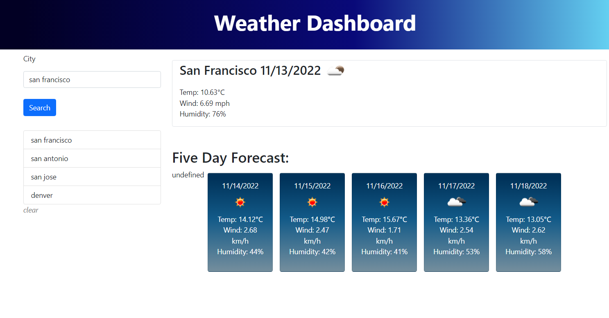

# Weather Dashboard

## Description

This project creates a dashboard the makes calls to the OpenWeather API and displays the current weather conditions for a searched city as well as the five day forecast in metric units. The user's search history is saved and displayed in a side bar list that allows the user to click on their previous searches to search that city again. The five day forecast displays data from the afternoon of the given day, for the most accurate idea of the temperature highs.  The link to the deployed site is below:

https://jennnmarshall.github.io/weather-dashboard

## Installation

N/A

## Usage

This weather dashboard is designed to allow a user to search for and view weather data from  multiple cities and revisit their search history. To use the dashboard, enter a city in the search bar and click the search button. To view data from your search history, click on a previously searched city from the list under the search bar. To clear your search history, click on the clear element under the search history list. 

## Credits

This project uses Bootstrap, jQuery, Openweather and Dayjs APIs for content, code formatting, and display purposes.

## License

Please refer to the license in the repo.